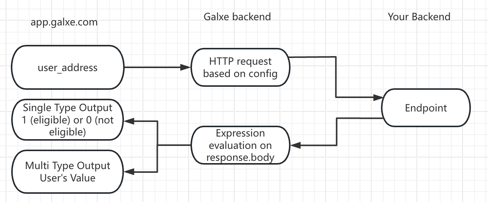

`GraphQL` credentials, including `Subgraph` credentials, let Galxe fetch data from your authorized GraphQL endpoint. During user verification, Galxe sends a query with the user’s address to the endpoint. The response is evaluated by a `JavaScript(ES6)` expression, returning `1` (eligible) or `0` (not eligible).

---

### **Workflow**

1. **app.galxe.com**: When a user clicks "Verify" on the Quest page, Galxe sends the user's wallet address or other social media information as an input parameter.
2. **Galxe Backend**: Based on the pre-configuration, Galxe sends an HTTP request containing the wallet address to your `GraphQL API` and waits for the response.
3. **Your Backend**: After receiving the HTTP request from Galxe, your backend processes the request and returns the response data related to the wallet address.
4. **Galxe Backend**: Processes the `response.body` from your backend using predefined expressions to determine if the user meets the conditions.
<Note>For Multi-type, the eligibility is determined based on the rules configured in the Quest, not just the expression output (`1/0`).</Note>
---

### **Configuration Requirements**

**API Specification**

- **Endpoint**:  
  The URL of the `GraphQL` endpoint.

<Note>We only support the default ports for HTTP and HTTPS (80 and 443).</Note>

- **(Optional) Headers**:  
  `Key-value` pairs included in the `GraphQL` request.

- **Query Info**:  
   Fill in the actual query logic within the `{}` of the pre-filled template, for example:
     ```graphql
     query info($address: String!) {
         user(address: $address) {
             isWhitelisted
             balance
         }
     }
     ```

**Parameter Mapping (Placeholders)**

- `$address`: Replaced with the user's wallet address as a hexadecimal string with the `0x` prefix, e.g., **`0x95ad73...`**.
- `$value`: Used when user information is not an address (email or Telegram ID) and replaced with the respective information.

<Warning>For addresses encoded in case-insensitive formats (EVM or Aptos address starting with `0x`), Galxe converts them to lowercase before sending to your endpoint.</Warning>

---

### **Response Requirements**
The body returned by `GraphQL` is in `JSON` format by default, compliant with Galxe's standards.

<Warning>Galxe requires requests to respond within 5 seconds; otherwise, the request will be canceled.</Warning>

---

### **Expression**

**Function Requirements**

1. Write an anonymous `JavaScript (ES6)` function with the type signature `(object) => int`.
2. The function takes the entire response object `resp` as a parameter.
3. It must return the number `1` or `0`, indicating whether the address qualifies for the credential.
<Warning>
Do not return Boolean values (`true/false`) or strings (`"0"/"1"`).
</Warning>

**Anonymous Function Format**

The function must be `anonymous`, with the first line written in the following format:

```javascript
function(resp) {
  /* Function body */
}
```

### **Security and Authorization**
When configuring the `GraphQL`, you can achieve secure access through request headers (such as `API KEY` or `tokens`). This information will not be exposed by Galxe, and only users with Space admin privileges can view it.
<Warning>You should still be careful not to embed other private information in the expression encoding, as this will be made public.</Warning>

### **CORS**

Galxe's API calls are not made through the browser but via backend servers. Although this avoids triggering browser CORS restrictions, we still send preflight `OPTIONS` requests during API configuration to validate the API's correctness.

<Tip>For more information, visit [CORS Check](/quest/credential-api/overview/cross-domain-check).</Tip>
