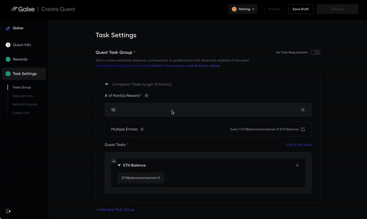

## Overview

REST Multi-Dimensional Credential allows you to fetch user data via RESTful APIs and validate eligibility across multiple dimensions. used to retrieve data for the extent of user participation. It is suitable when the verification for tasks is equivalent to answering the question, *How much, how often, or how many times did a user perform the task?*

***

## Config process

### 1. Finding the Config in Task Settings

The option to configure API credential can be found in step 3, `Task Settings` of quest creation on the Galxe Dashboard.

### 2. Basic Config

* **ID Type**

`ID Type` provides various identity options, including social accounts, blockchain addresses, and other unique identifiers.

* **Title**

Give your credential descriptive title matching the task at hand.

* **Credential Source**

Choose `REST` type and select `GET` or `POST` based on your API request type.

* **Type**

Choose `Multi Dimension`

### 3. Specify Dimensions

In Multi-Dimensional Credential configuration, you need to define specific dimensions to ensure each dimension is clearly identified and usable.


* **Identifier**:

  * Enter a unique identifier for the dimension, e.g., `mainnet_eth_balance`.

  * The identifier is used for internal calls and logic operations, and it must be globally unique.

* **Display Name**:

  * Enter a display name for the dimension, e.g., `ETH balance on Mainnet`.

  * This name will be displayed in the UI for user understanding.

* **Type**:

  * Select the dimension type `COUNTER` from the dropdown menu.

* **Description**:

  * Enter a description to explain the purpose of the dimension, e.g., "This dimension tracks the ETH balance of a user on Mainnet".

  * The description must be within 256 characters.

### 4. Configure API

* **Input Endpoint**:

GET Request Example:

```plaintext
https://api.example.com/check-user?wallet=$address
```

POST Request Example:

```plaintext
https://api.example.com/check-user
```

* **Add Headers (Optional)**:

```json
`Authorization`: `Bearer YOUR_API_KEY`
```

* **Input Body (For POST Requests Only)**:

```json
{
  "check_user_address": "$address"
}
```

### 5. Test API Response

* **Input a test address and send the request to confirm the response**:

```json
  {
    "isWhitelisted": true,
    "balance": 1000
  }
```

### 6. Write Expressions

* **Token Balance Output**:

```javascript
  function(resp) {
      return {
        "mainnet_eth_balance": resp.balance
      };
  }
```

### 7. Description

Description of the certificate, supports rich text input, maximum 200 characters.

### 8. Call-to-Action Link

Guide users to specific operation pages to complete interactive tasks.

### 9. Participation End Time && Update Frequency (Optional)

* **Participation End Time**:

Control the time range of the credential, prohibiting new validations after the deadline.

* **Update Frequency**:

Remind users of the frequency of API data source updates, such as once a day or once every two days.

### 10. Config Rule

Configure rules in Quest to determine whether users meet the criteria.

* **Threshold Evaluation**:


When a certain threshold condition is met (e.g., >0), assign a fixed points directly.

* **Multiple Entries(Optional)**:



Enable users to claim rewards repeatedly once certain credentials are fulfilled, for example, a user earns 10 points for each 1 ETH they hold. If the user holds 5 ETH, they will earn 50 points.

***

## Example

### ETH Balance Amount

* **Specify Dimensions**

Identifier:`mainnet_eth_balance`

Display Name:`ETH balance on Mainnet`

Type:`COUNTER`

Description:`The amount of ETH you hold on mainnet`

* **Endpoint**

```plaintext
https://mainnet.infura.io/v3/YOUR-API-KEY
```

* **Request Type**

`POST`

* **Headers**

`No header`

* **Body**

```json
{
    "jsonrpc": "2.0",
    "method": "eth_getBalance",
    "params": [
        "$address",
        "latest"
    ],
    "id": 1
}
```

* **Response**

```json
{
    "jsonrpc": "2.0",
    "id": 1,
    "result": "0x7c2562030800"
}
```

* **Expression**

```javascript
function(resp) {
 try {
    let balance = BigInt(resp.result);
    return { "mainnet_eth_balance": balance };
 } catch (error) {
    return { "mainnet_eth_balance": 0 };
 }
}
```