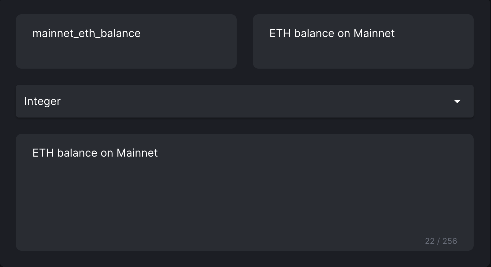

## Introductions[](#introductions "Direct link to heading")

GraphQL-sourced credential, including Subgraph credential, is a way for Galxe to pull data from your GraphQL endpoint (or any endpoint that you are legally allowed to use). When a user tries to verify himself on Galxe, Galxe will construct a GraphQL Query, where the address of the user will be passed in as the argument, and send it to the specified endpoint. After response is received, it will be passed to the Javascript expression, where it will return 0(false)/1(true) to indicate whether the wallet address is eligible.

The workflow is

```
app.galxe.com                          galxe backend                                 your backend
---------------------------------------------------------------------------------------------
user_address          ---->   GraphQL Query based on config             ---->        Endpoint
crendential for user  <----   Expression evaluation on response         <----

```

### GraphQL Endpoint (HTTPs):[](#graphql-endpoint-https "Direct link to heading")

Please note that for custom ports, we only support 80, 443, and 8000.

It's the HTTPs endpoint where Subgraph queries go to, see the example below.

**For security reasons, you must add _[https://dashboard.galxe.com](https://dashboard.galxe.com)_ to the API server's [`Access-Control-Allow-Origin`](https://developer.mozilla.org/en-US/docs/Web/HTTP/Headers/Access-Control-Allow-Origin) header to avoid [CORS](https://developer.mozilla.org/en-US/docs/Web/HTTP/CORS) issues. Please note that you will also need to set the `access-control-allow-methods`, as if we are sending a preflight request. We will perform a [CORS check](https://developer.mozilla.org/en-US/docs/Web/HTTP/Methods/OPTIONS#preflighted%5Frequests%5Fin%5Fcors) during the creation process, and if it's not included, the creation will fail.**

Please note that when we check the endpoint, we _always_ send a preflight request, **ignoring the so-called [simple_requests](https://developer.mozilla.org/en-US/docs/Web/HTTP/CORS#simple_requests) convention**, for security reasons. You might see that your configuration works ok when clicking test button in our app, but later failed to save. We always encourage you to use the following cURL command to check if the endpoint is compliant.

To check if it is compliant, you can use cURL:

```
// for GraphQL
curl --head -X 'OPTIONS' -H 'Access-Control-Request-Headers: Content-Type' -H 'Access-Control-Request-Method: POST' -H 'Origin: https://dashboard.galxe.com' '$YOUR_URL_HERE$'

// Example of a correct query and response
curl --head -X 'OPTIONS' -H 'Access-Control-Request-Headers: Content-Type' -H 'Access-Control-Request-Method: POST' -H 'Origin: https://dashboard.galxe.com' 'https://graphigo.prd.galaxy.eco/'
access-control-allow-origin: https://dashboard.galxe.com
access-control-allow-methods: POST,GET,OPTIONS
```

**And we require that requests must be responded to within 5 seconds; otherwise, we will cancel the request.**

Please note that for addresses encoded with case-insensitive schema, like EVM and aptos addresses that are 0x-prefixed hex string, addresses will be **lowercased** before sending to the endpoint.

NOTE: If you saw a error when testing the API during creating a credential, check if the endpoint is a **valid** GraphQL API endpoint. Common misconfigurations include

1. incorrectly used a GraphQL _playground_ url, that usually ends with `/graph`,
2. incorrectly used a URL to the subgraph explorer page, like `https://thegraph.com/explorer/***`. Usually, the correct endpoint from subgraph is like this `https://api.thegraph.com/subgraphs/***`

### Query:[](#query "Direct link to heading")

The GraphQL query, that it must take a single wallet address as input. For more detials, please refer to [Querying The Graph](https://thegraph.com/docs/en/querying/querying-the-graph/). In dashboard, once you finish your query, fill in a test address and click 'Run' button to check if the query's response is expected.

### Expression:[](#expression "Direct link to heading")

Expression is used to evaluate against the reponse to check if the address is eligible for the credential. It is a JavaScript (ES6) function of type signature: `(object) => int`. The function should return either number 1 or 0, representing if the address is eligible for this subgraph credential. Do not return `true` or `false`, neither string-typed `"0"` or `"1"`. Behind the scenes, first, we send the query with the user's address to the GraphQL endpoint, and then we will apply the function against the `data` field of the [GraphQL HTTP response](https://graphql.org/learn/serving-over-http/#response). If the returned value is 1, then user can own this credential, otherwise not. The function must be anonymous, which means that the first line of the expression should be like `function(data) {}`, instead of `let expression = (data) => {}`.

## Subgraph Examples[](#subgraph-examples "Direct link to heading")

### Endpoint[](#endpoint "Direct link to heading")

```
https://api.thegraph.com/subgraphs/name/hyd628/nomad-and-connext

```

### Query[](#query-1 "Direct link to heading")

```java
query info($address: String!) {
  receiveds(
    where: {
      recipient: $address
      block_gt: 1400000
      token_in: [
        "0x8f552a71EFE5eeFc207Bf75485b356A0b3f01eC9"
        "0x1DC78Acda13a8BC4408B207c9E48CDBc096D95e0"
        "0x30D2a9F5FDf90ACe8c17952cbb4eE48a55D916A7"
      ]
    }
  ) {
    id
  }
  fulfilleds(where: { user: $address, timestamp_gt: 1651986604 }) {
    id
    timestamp
  }
}

```

### Query output[](#query-output "Direct link to heading")

```json
{
  "receiveds": [
    {
      "id": "0x000abcdefg..."
    }
  ],
  "fullfilleds": []
}
```

### Single Expression[](#expression-1 "Direct link to heading")

```java
function(resp) {
  if (resp != null && (resp.fulfilleds != null && resp.fulfilleds.length > 0 || resp.receiveds != null && resp.receiveds.length > 0)) {
     return 1
  }
  return 0
}

```

### Single Expression output[](#expression-output "Direct link to heading")

```
1

```

**Multi Expression**



```java
function(resp) {
  try {
    let balance = BigInt(resp.result);
    return { "mainnet_eth_balance": balance };
  } catch (error) {
    return { "mainnet_eth_balance": 0 };
  }
}

```

### Multi Expression[](#expression-output "Direct link to heading")

```
"mainnet_eth_balance": 10

```

## FAQ: Users getting 403 error?[](#faq-users-getting-403-error "Direct link to heading")

Make sure the endpoint has whitelisted our server:

```
35.185.209.0
35.203.155.18
```
